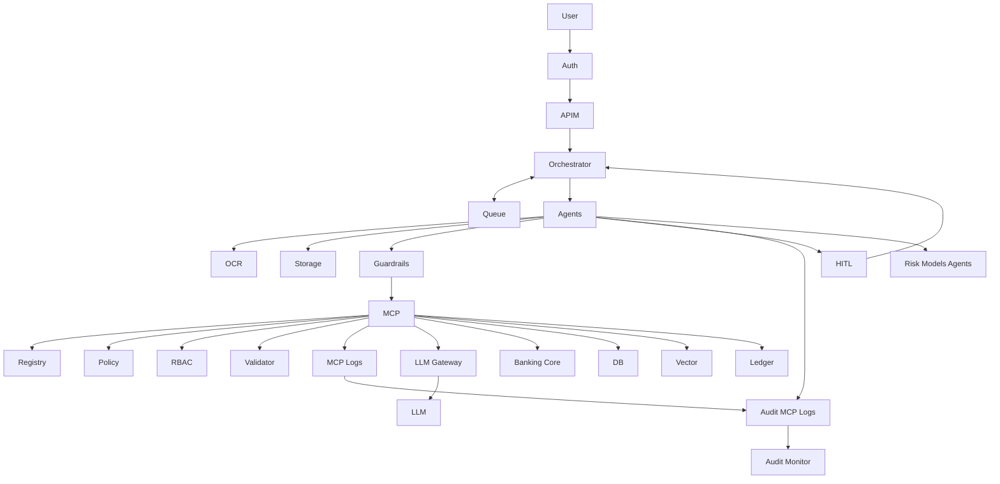

# Banking AI (Cheque + Trade Processing System)**

## **Step 1: Architecture (Banking-grade)**

* Use **event-driven microservices**
* Components:

  * Ingestion Service (Docs, Cheques, SWIFT, PDFs)
  * OCR + Doc AI (Amazon Textract / Azure Form Recognizer)
  * Multi-Agent Orchestrator (LangGraph / Temporal)
  * Decision Engine (LLM + Rules)
  * Human-in-loop Service
  * Audit & Compliance Layer
* Add **Kafka / AWS Kinesis** for async processing

---

## **Step 2: Multi-Agent Design**

Define **clear agent responsibilities (no overlap):**

* **Extraction Agent** → OCR + structured parsing
* **Validation Agent** → Regulatory rules (AML, KYC)
* **Risk Agent** → Fraud signals, anomaly detection
* **Decision Agent** → Approve / Reject / Escalate
* **Audit Agent** → Logs every reasoning step

Use:

* LangGraph for deterministic flows
* Guardrails at **each node**, not just entry

---

## **Step 3: Human-in-the-Loop (Critical for Banking)**

* Confidence scoring per agent
* If < threshold → route to human queue
* UI:

  * Highlight extracted fields
  * Show model reasoning trace
* Store:

  * Human corrections → feedback loop (fine-tuning dataset)

---

## **Step 4: Compliance & Explainability**

* Store:

  * Prompt
  * Model output
  * Tool calls
  * Final decision
* Use:

  * Immutable logs (AWS QLDB / append-only DB)
* Build:

  * “Why this decision?” API (mandatory for audits)

---

## **Step 5: Guardrails (Enterprise Level)**

* Prompt injection detection (input sanitizer agent)
* PII masking before LLM
* Output validation:

  * JSON schema enforcement
  * Rule engine cross-check

---

## **Step 6: Data Layer**

* PostgreSQL → transactions
* Vector DB (pgvector / Pinecone) → document retrieval
* Object storage → raw docs (S3)

---

## **Step 7: Deployment**

* Use:

  * Bedrock / Azure OpenAI (no raw OpenAI for banks)
* Private VPC + no internet access
* API Gateway + IAM roles
* Canary deployments for models

---

## **Step 8: Monitoring**

* Metrics:

  * Accuracy
  * False positives (fraud)
  * Latency per agent
* Use:

  * Prometheus + Grafana
  * LLM eval pipelines (RAGAS, DeepEval)

---

Where to Use MCP in Your Two Systems
1. Banking AI (Cheque / Trade System)
MCP should sit between:
Agents ↔ Core Banking APIs
Example MCP Tools:
get_account_details
validate_cheque
check_sanctions_list
fetch_trade_document
Flow:
Validation Agent
   ↓
MCP Tool Call (validate_cheque)
   ↓
Banking API

👉 No agent directly touches banking systems

How to Implement MCP (Step-by-Step)
Step 1: Define MCP Server
Build MCP server (FastAPI / Node)
Register tools with:
Name
Input schema
Output schema
Permissions
Step 2: Tool Registry

Each tool must have:

Strict schema (JSON)
Access control (RBAC)
Audit logging
Step 3: Secure Execution Layer
Add:
Input validation
Rate limiting
PII masking
Never expose raw APIs
Step 4: Integrate with LangGraph
Replace direct tool calls with MCP calls
Each agent:
Calls MCP
Not external APIs
Step 5: Observability

Log:

Tool requested
Agent reasoning
Input/output
User identity
MCP + Guardrails (Very Important)

MCP is NOT just tools — combine with:

Policy engine (OPA)
Prompt firewall
Output validator

### Final Architecture Path

1. **User / Client UI**
2. **Auth & API Management (Azure APIM)**
3. **Orchestrator (LangGraph)**
4. **Multi-Agent System** (Extraction, Validation, Risk, Decision, Audit)
5. **Guardrails Layer** (Safety & Compliance Checks)
6. **MCP Server Layer** (Secure tool execution)
7. **Enterprise Systems** (Core Banking APIs, DBs, Storage)
8. **Immutable Audit Logs** (Azure Data Explorer / Log Analytics)

---

### Resources
* [Architecture PDF](file:///home/dhiraj/Desktop/python/banking_ai/cheque_trade_processing_system/Azure%20+%20MCP%20+%20Guardrails%20+%20HITL.pdf)
* [Mermaid Source File](file:///home/dhiraj/Desktop/python/banking_ai/cheque_trade_processing_system/Azure%20+%20MCP%20+%20Guardrails%20+%20HITL.mmd)

### Architecture Diagrams

### Mermaid Diagram Source

