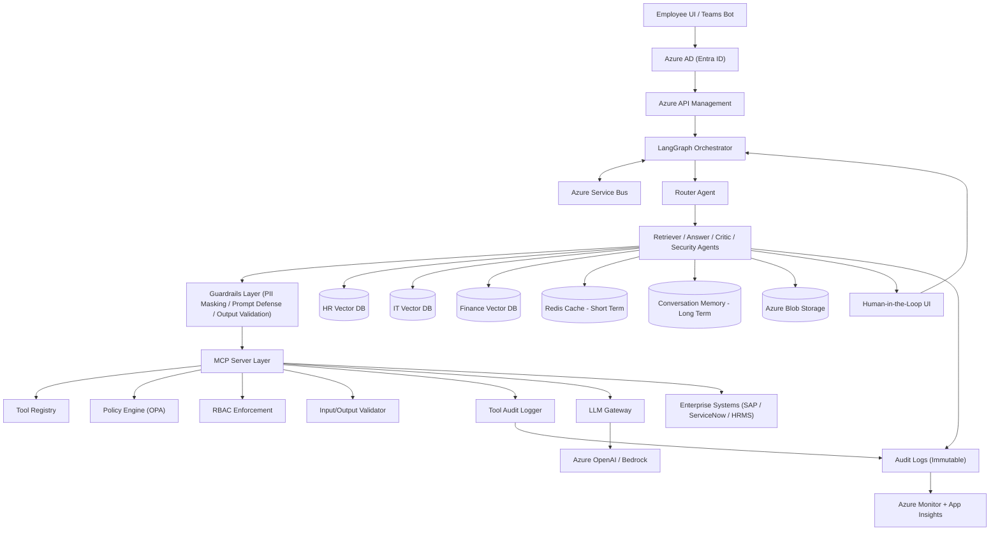

# 🚀 Enterprise GPT: Multi-Agent HR, IT & Finance Intelligence

An advanced, multi-agent RAG (Retrieval-Augmented Generation) system designed for enterprise-scale environments. This platform orchestrates specialized AI agents to handle HR, IT, and Finance queries with robust security, auditability, and human-in-the-loop capabilities.

---

## 🏗️ System Architecture

The following diagram illustrates the high-level flow from user interaction to enterprise system integration, highlighting the secure MCP layer and guardrails.

---

## 🌟 Key Features

### 🤖 Specialized Multi-Agent Swarm
- **Router Agent**: Intelligent intent classification to route queries to the correct domain (HR, IT, or Finance).
- **Retriever Agents**: Domain-specific retrieval optimized for high-accuracy document fetching.
- **Answer Agent**: Generates context-aware, professional responses.
- **Critic Agent**: Validates responses for hallucinations and ensures factual accuracy.
- **Security Agent**: Enforces RBAC and ensures data privacy at the agent level.

### 🛡️ Secure MCP Layer (Model Context Protocol)
The system utilizes MCP as a secure abstraction layer between the LLM and internal enterprise systems.
- **Tool Registry**: Versioned and strictly typed tool definitions.
- **Policy Engine (OPA)**: Fine-grained access control for every tool execution.
- **PII Masking**: Automatic detection and redaction of sensitive information before it reaches the model.

### 🧠 Advanced Memory Management
- **Short-Term Memory**: Powered by Redis for sub-millisecond context retrieval during active sessions.
- **Long-Term Memory**: Vectorized conversation history allowing the system to "remember" user preferences and past interactions over time.

---

## 🛠️ Technological Stack

| Component | Technology |
| :--- | :--- |
| **Orchestration** | LangGraph, Azure Service Bus |
| **LLMs** | Azure OpenAI (GPT-4), AWS Bedrock (Claude 3.5) |
| **Vector Databases** | Pinecone, pgvector |
| **Caching** | Redis |
| **Security** | Entra ID (Azure AD), Azure API Management |
| **Observability** | Azure Monitor, App Insights, Immutable Audit Logs |

---

## 🔒 Enterprise-Grade Security

- **RBAC (Role-Based Access Control)**: Integrated with Azure AD to ensure users only see information they are authorized to access.
- **Guardrails Layer**: Implements prompt injection defense and output validation to prevent "jailbreaking" and ensure brand-safe responses.
- **Immutable Audit Logs**: Every interaction, tool call, and agent decision is logged to an immutable storage for compliance and forensic analysis.

---

## 💡 Use Cases

- **HR Self-Service**: "How many vacation days do I have left?" or "Explain the new health insurance policy."
- **IT Support**: "Reset my VPN password" or "Report a broken laptop."
- **Finance Inquiries**: "What is the status of my latest expense report?" or "How do I request a budget increase?"

---

## 🚀 Future Roadmap

- [ ] **Cross-Domain Reasoning**: Allowing agents to collaborate on complex queries that span multiple departments.
- [ ] **Proactive Notifications**: Agents can alert users of pending approvals or policy changes via Teams.
- [ ] **Self-Improving RAG**: Automatic fine-tuning based on human-in-the-loop feedback signals.

---

*Built with ❤️ for Modern Enterprise Intelligence.*